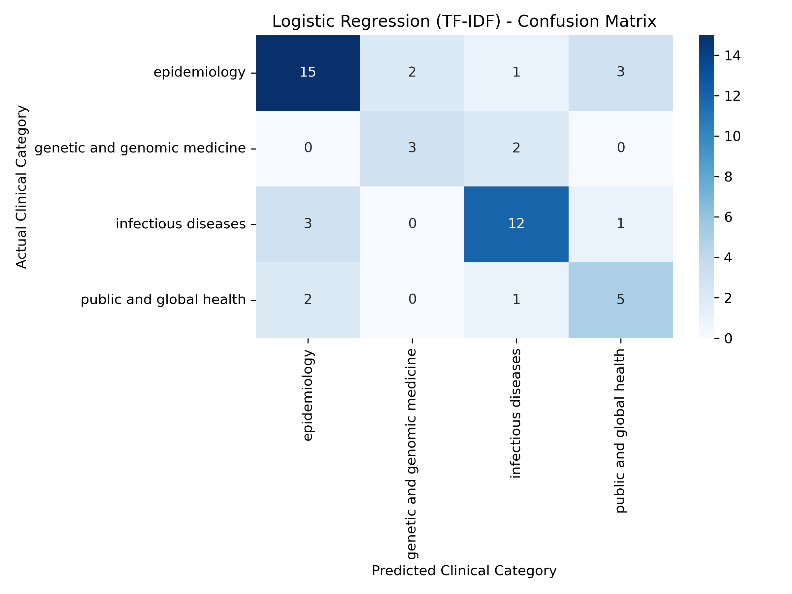

<!DOCTYPE html>
<html lang="en">
<head>
    <meta charset="UTF-8">
    <meta name="viewport" content="width=device-width, initial-scale=1.0">
    <title>Baron Offei-Darko | Data Scientist</title>
    <link rel="stylesheet" href="style.css">
    <link rel="stylesheet" href="https://cdnjs.cloudflare.com/ajax/libs/font-awesome/6.4.0/css/all.min.css">
</head>
<body>

    <!-- The "Sheet of Paper" -->
    

        
        <!-- LEFT HALF: Details & CV -->
        

            
            
            <h1 class="name">Baron Offei-Darko</h1>
            <h2 class="role">Data Scientist</h2>
            
            

                <a href="https://www.linkedin.com/in/baron-offei-darko-077b1b171/" target="_blank"><i class="fab fa-linkedin"></i> LinkedIn</a>
                <a href="mailto:baronoffeid@gmail.com"><i class="fas fa-envelope"></i> baronoffeid@gmail.com</a>
                <i class="fas fa-map-marker-alt"></i> England
                <i class="fas fa-phone"></i> +44 7459144832
            

            <a href="BaronCV_OD_prof.pdf" target="_blank" class="cv-button">
                <i class="fas fa-download"></i> Download CV (PDF)
            </a>

            

                <h3>Technical Skills</h3>
                
Python, SQL, Deep Learning, Machine Learning, LLMs, Tableau, NumPy, Matplotlib, Pandas, AWS, Azure, Node.js, Java, C, HTML, Power BI, MATLAB.

            

            

                <h3>Education</h3>
                
<strong>MSc Data Science</strong> University of Kent <em>(Sept 2025 - Present)</em>

                
<strong>BEng Computer Science (Hons)</strong> Anglia Ruskin University

            

        

        <!-- RIGHT HALF: Projects -->
        

            <h2 class="section-title">Portfolio Projects</h2>

            <!-- Project 1 -->
            

                
                

                    <h3>
                        <a href="https://github.com/Baron017/image-classification" target="_blank">Deep Learning Image Classification</a>
                    </h3>
                    
Developed an end-to-end computer vision pipeline to classify 112,500 images across 15 categories. Achieved 92.26% accuracy using a custom VGG-style CNN with optimized hyperparameter tuning and targeted dropout to eliminate overfitting.

                

            

            <!-- Project 2 -->
            

                
                

                    <h3>
                        <a href="https://github.com/Baron017/document-Classifier-" target="_blank">LLM Document Classifier</a>
                    </h3>
                    
Built an automated data ingestion pipeline to extract medical preprint abstracts and fine-tuned a domain-specific LLM (BioMedBERT) for multi-class sequence classification. Designed a custom evaluation framework using Scikit-learn to optimize the Macro F1-score.

                

            

        

    

</body>
</html>
